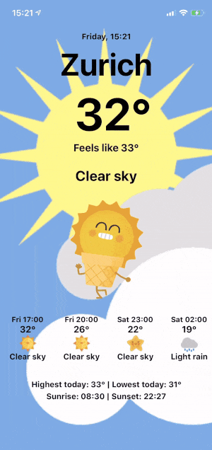

# Weatheruu

Ever gotten depressed when you open up a weather app, and every single day, it shows you that it's going to be bad weather? Well, I live in Sweden, and that's what I experience daily!

Weatheruu was created to make weather application users happier by presenting weather information in a "happy" way. Sunny outside? Yay! A dancing sun appears! Oh no, it's raining? Don't worry too much about it, here's a cute little cloud for you!

In the application, an user can save up to five different favorite locations at the same time. After that, just scroll left or right and enjoy seeing the weather for the first time!

The application is still under development. It was developed using React Native.
